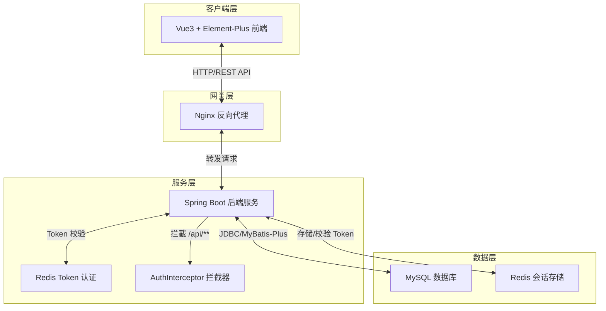
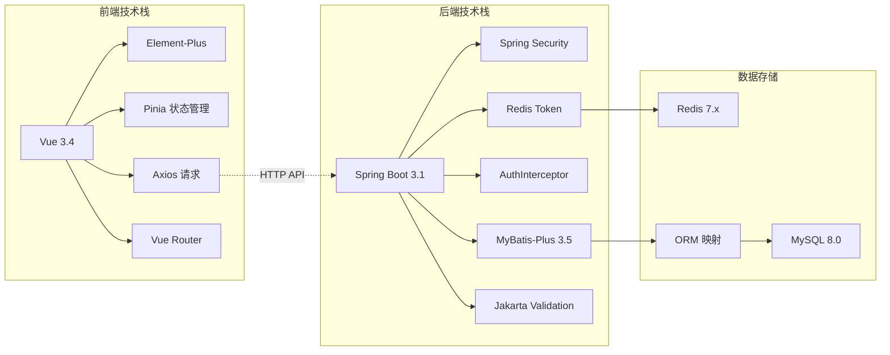
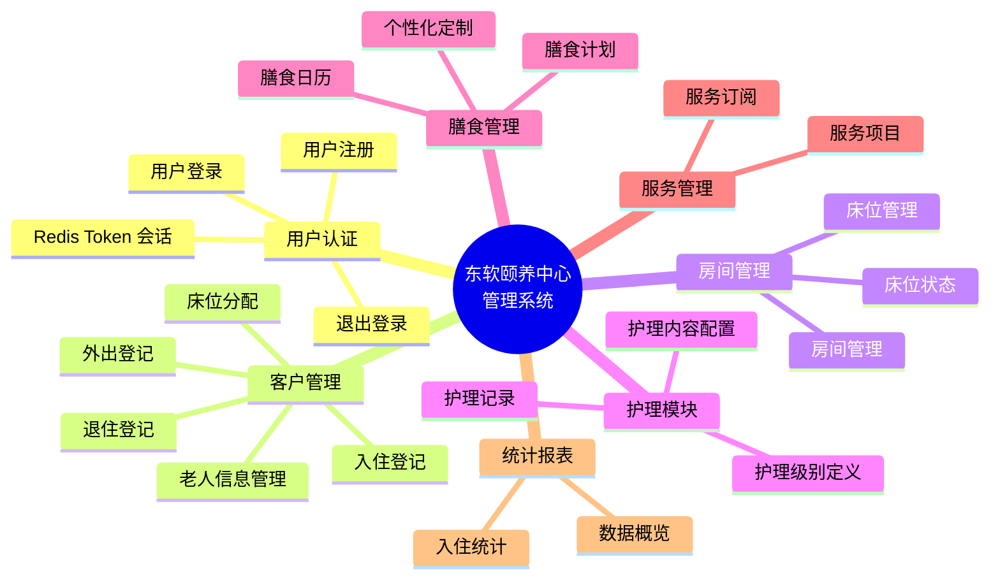
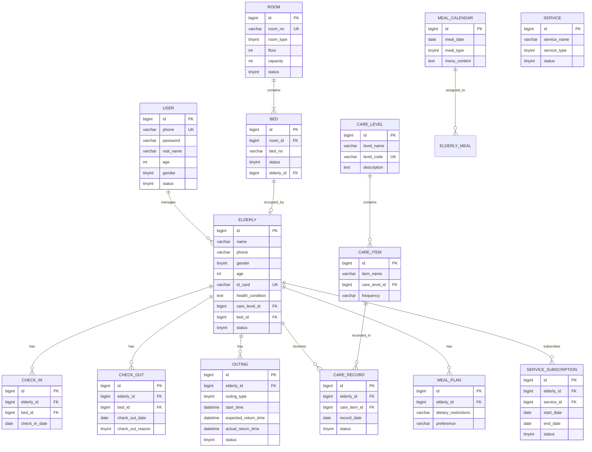
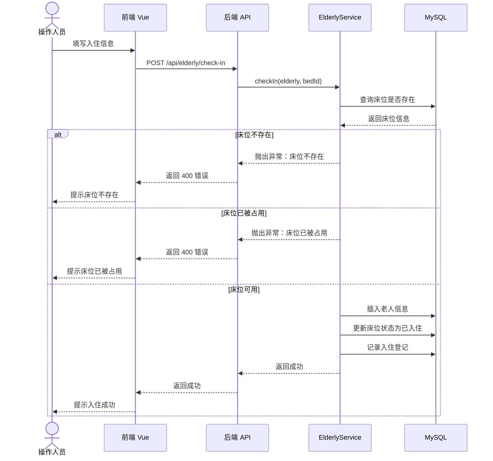
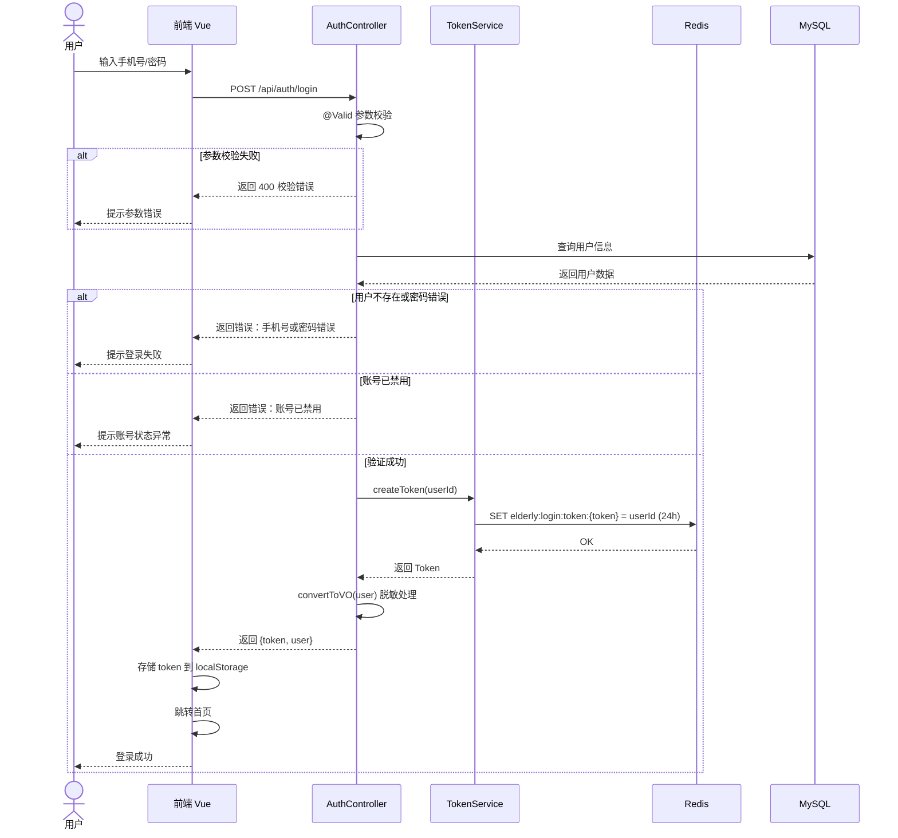
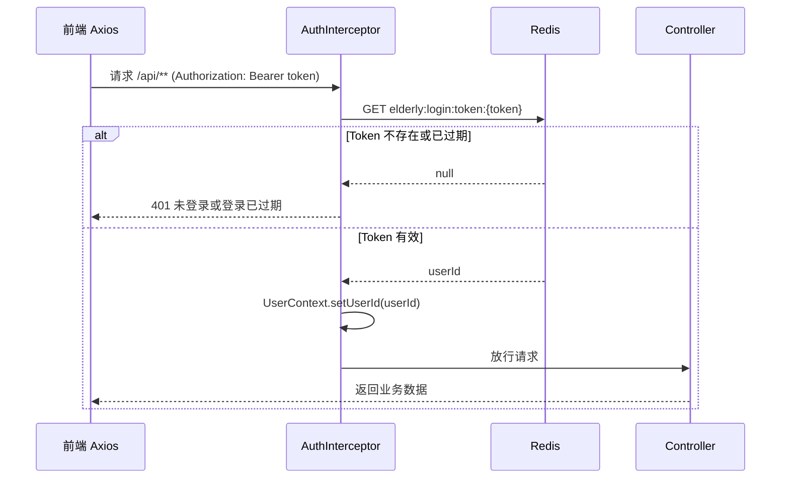
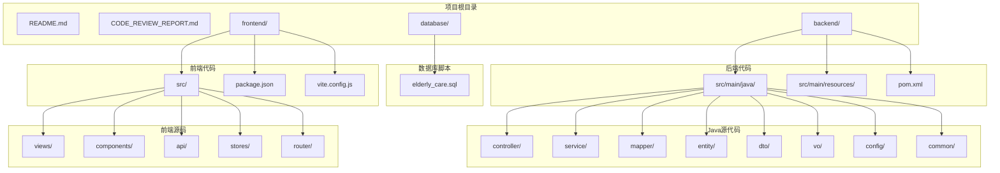

# 东软颐养中心管理系统

<p align="center">
  
  
  
  
</p>

## 项目简介

东软颐养中心管理系统是一个为养老服务机构设计的综合管理平台，采用前后端分离架构，提供老人管理、床位管理、护理管理、膳食管理、服务管理等核心功能。

---

## 系统架构图

### 整体架构（交互链）



---

## 技术栈架构



---

## 功能架构（功能网）



---

## 数据库 ER 图（逻辑树）



---

## 核心业务流程

### 老人入住流程



### 用户登录认证流程



### API 请求认证流程



---

## API 接口架构

```mermaid
flowchart TB
    subgraph 认证模块
        AUTH_REG[/api/auth/register\nPOST - 注册/]
        AUTH_LOGIN[/api/auth/login\nPOST - 登录/]
        AUTH_LOGOUT[/api/auth/logout\nPOST - 退出/]
    end

    subgraph 老人管理
        ELD_LIST[/api/elderly/page\nGET - 老人列表/]
        ELD_SAVE[/api/elderly\nPOST - 新增老人/]
        ELD_CHECKIN[/api/elderly/check-in\nPOST - 入住登记/]
        ELD_CHECKOUT[/api/elderly/check-out\nPOST - 退住登记/]
    end

    subgraph 房间床位
        ROOM_LIST[/api/room/list\nGET - 房间列表/]
        BED_LIST[/api/bed/list\nGET - 床位列表/]
        BED_AVAIL[/api/bed/available\nGET - 空闲床位/]
    end

    subgraph 护理管理
        CARE_LEVEL[/api/care/level/list\nGET - 护理级别/]
        CARE_ITEM[/api/care/item/list\nGET - 护理内容/]
        CARE_REC[/api/care-record/list\nGET - 护理记录/]
    end

    subgraph 膳食管理
        MEAL_CAL[/api/meal/calendar/list\nGET - 膳食日历/]
        MEAL_PLAN[/api/meal/plan/{id}\nGET - 膳食计划/]
    end

    subgraph 服务管理
        SVC_LIST[/api/service/list\nGET - 服务项目/]
        SVC_SUB[/api/service/subscription\nPOST - 服务订阅/]
    end

    subgraph 统计报表
        STAT_DASH[/api/statistics/dashboard\nGET - 数据概览/]
    end
```

---

## 项目结构



---

## 快速启动

### 1. 数据库
```bash
mysql -u root -p -e "CREATE DATABASE IF NOT EXISTS elderly_care DEFAULT CHARACTER SET utf8mb4;"
mysql -u root -p elderly_care < database/elderly_care.sql
```

### 2. Redis
```bash
docker run -d -p 6379:6379 --name redis redis
```

### 3. 后端
```bash
cd backend
mvn clean install
mvn spring-boot:run
```

### 4. 前端
```bash
cd frontend
npm install
npm run dev
```

---

## 默认账号

- **手机号**: 13800138000
- **密码**: 123456

---

## 功能清单

| 模块 | 功能 | 状态 |
|------|------|------|
| 用户认证 | 注册、登录、退出、Redis Token（24h） | ✅ |
| 老人管理 | 增删改查、入住/退住 | ✅ |
| 房间管理 | 房间、床位管理 | ✅ |
| 外出登记 | 外出登记、返回确认 | ✅ |
| 护理模块 | 级别、内容、记录 | ✅ |
| 膳食管理 | 日历、计划 | ✅ |
| 服务管理 | 项目、订阅 | ✅ |
| 统计报表 | 数据概览 | ✅ |

---

## 开发团队

东软教育 - 颐养中心项目组

---

## 许可证

MIT License
