# 东软颐养中心系统技术方案评估报告

> 评估日期：2026-05-19\
> 评估场景：AI 辅助编程\
> 目标：选择最优全栈技术方案

***

## 一、项目概述

### 1.1 系统定位

养老院/颐养中心管理系统，核心功能模块：

- 客户管理（床位、膳食、入住/退住/外出登记）
- 护理管理（护理级别、护理内容、护理记录）
- 服务关注（客户购买的服务信息）
- 健康管家关系管理

### 1.2 约束条件

- **开发模式**：AI 辅助编程（核心考量）
- **团队规模**：小型团队 / 个人开发者
- **目标平台**：Web 端（PC 管理后台）
- **用户群体**：养老机构管理人员、护理人员

***

## 二、推荐技术栈分析

### 2.1 方案概览：Spring Boot + Vue3

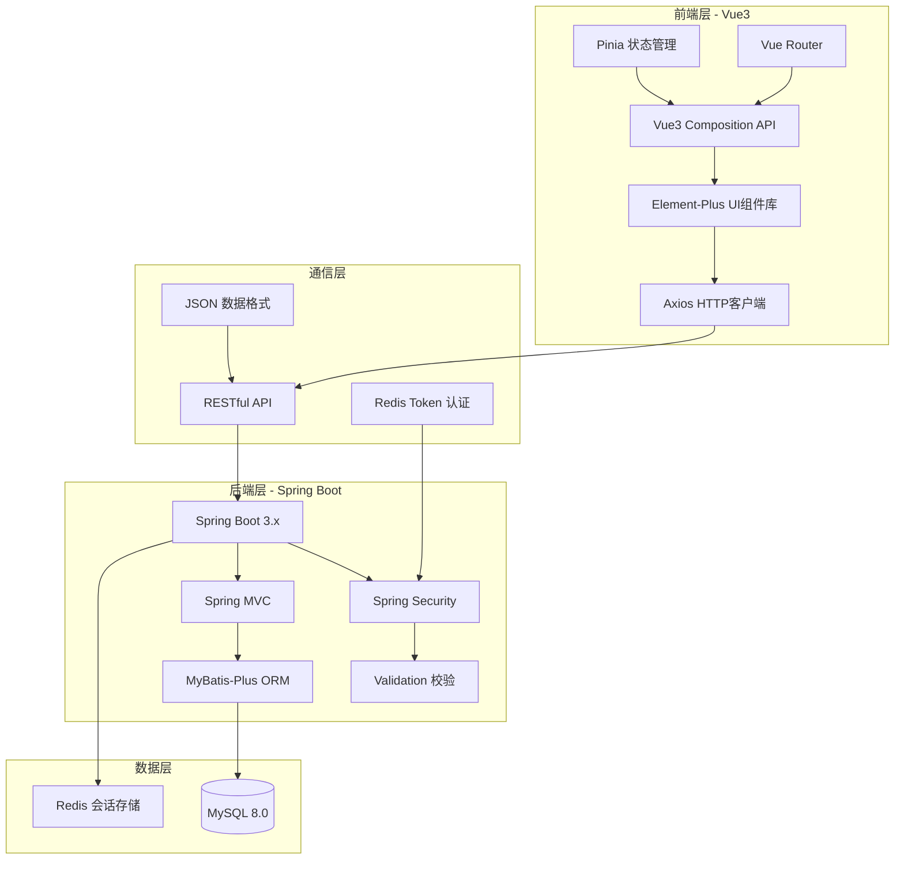

### 2.2 AI 友好性评分

| 维度       | 评分     | 说明                                   |
| -------- | ------ | ------------------------------------ |
| 代码生成质量   | 5星     | Spring Boot 和 Vue3 是 AI 训练数据最丰富的框架之一 |
| 错误修复能力   | 5星     | 文档完善，问题解决方案海量，AI 上下文理解准确             |
| 架构理解度    | 5星     | 分层清晰，AI 能快速理解 MVC/分层架构               |
| 脚手架生成    | 5星     | Spring Initializr + Vite 脚手架标准化      |
| 调试辅助     | 4星     | 日志体系完善，但 Java 堆栈较长                   |
| **综合评分** | **5星** | **AI 编程首选组合**                        |

### 2.3 技术选型详细说明

#### 后端：Spring Boot 3.x + MyBatis-Plus

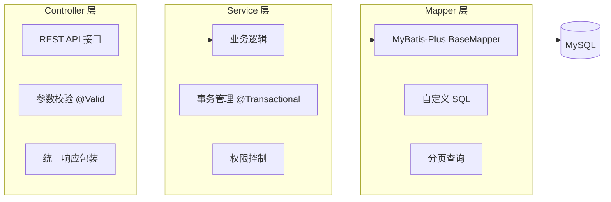

**关键优势**：

- **MyBatis-Plus**：零 SQL 实现 CRUD，AI 生成代码准确率高
- **Spring Security**：RBAC 权限模型标准化，适合养老机构多角色场景
- **Validation**：注解式校验，减少样板代码

#### 前端：Vue3 + Element-Plus

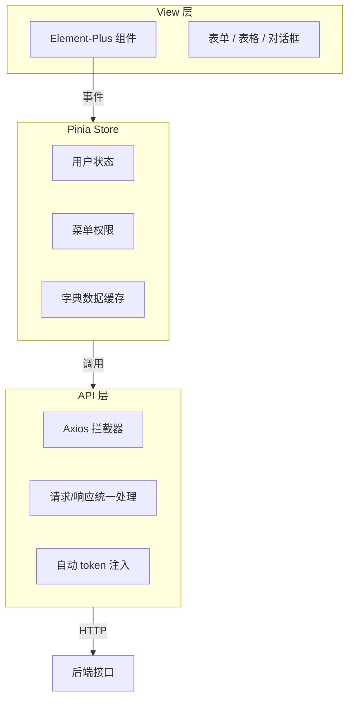

**关键优势**：

- **Composition API**：逻辑复用性强，AI 生成代码结构清晰
- **Element-Plus**：中后台组件库首选，表格/表单场景覆盖完善
- **TypeScript**：类型提示提升 AI 代码生成准确性

***

## 三、备选方案对比分析

### 3.1 方案对比总览

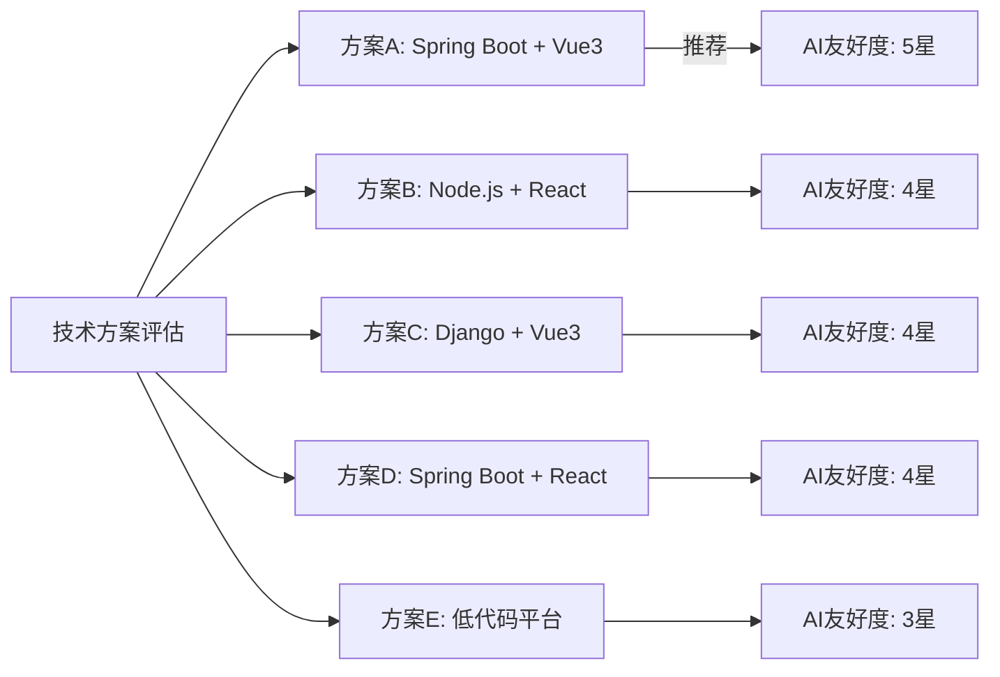

### 3.2 详细对比表

| 对比维度              | 方案ASpring Boot+Vue3 | 方案BNode.js+React | 方案CDjango+Vue3 | 方案DSpring Boot+React | 方案E低代码平台 |
| ----------------- | ------------------- | ---------------- | -------------- | -------------------- | -------- |
| **AI 代码生成质量**     | 5星                  | 4星               | 4星             | 4星                   | 3星       |
| **中后台组件生态**       | 5星                  | 4星               | 3星             | 4星                   | 4星       |
| **TypeScript 支持** | 5星                  | 4星               | 3星             | 5星                   | 3星       |
| **企业级安全性**        | 5星                  | 4星               | 4星             | 5星                   | 3星       |
| **部署运维成本**        | 3星                  | 4星               | 4星             | 3星                   | 5星       |
| **长期维护性**         | 5星                  | 4星               | 4星             | 5星                   | 3星       |
| **团队招聘友好度**       | 5星                  | 4星               | 3星             | 4星                   | 4星       |
| **开发速度（AI辅助）**    | 5星                  | 4星               | 4星             | 4星                   | 5星       |
| **定制灵活性**         | 5星                  | 5星               | 4星             | 5星                   | 2星       |
| **综合推荐度**         | **5星**              | 4星               | 4星             | 4星                   | 3星       |

### 3.3 各方案深度分析

#### 方案B：Node.js (NestJS) + React + Ant Design

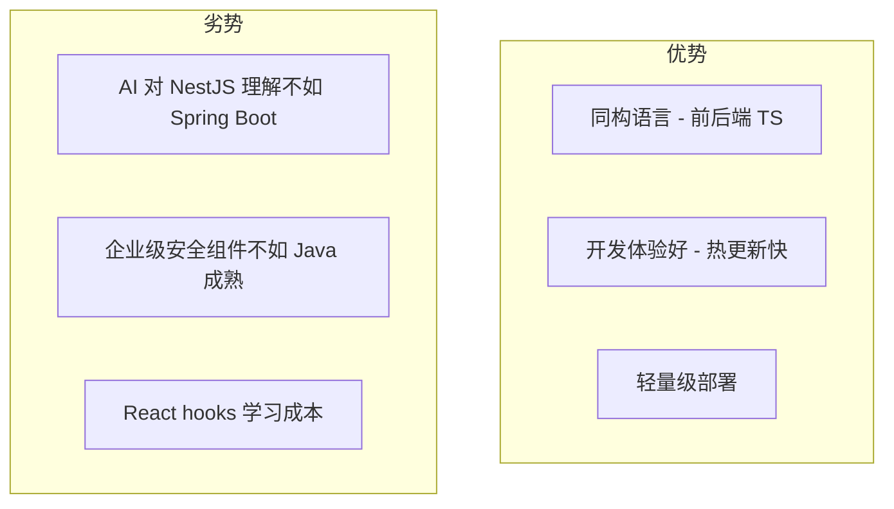

**适用场景**：团队已有 Node.js 经验，追求开发速度

***

#### 方案C：Django + Vue3

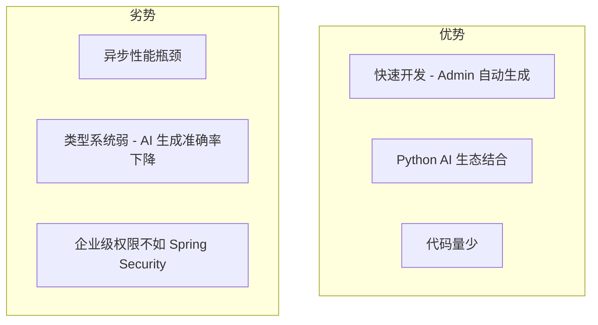

**适用场景**：快速原型开发，后期可能结合 AI 功能模块

***

#### 方案D：Spring Boot + React

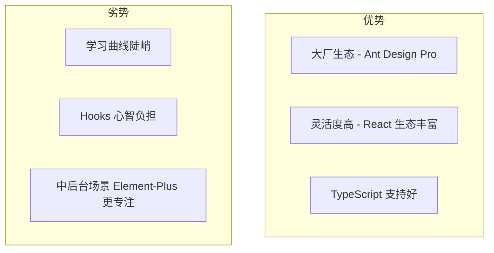

**适用场景**：复杂交互需求，团队 React 经验丰富

***

#### 方案E：低代码平台 (JeecgBoot/若依)

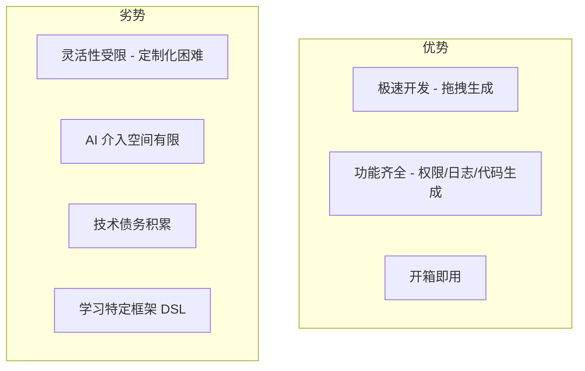

**适用场景**：超快速交付，标准化需求无特殊定制

***

## 四、推荐架构详细设计

### 4.1 系统整体架构

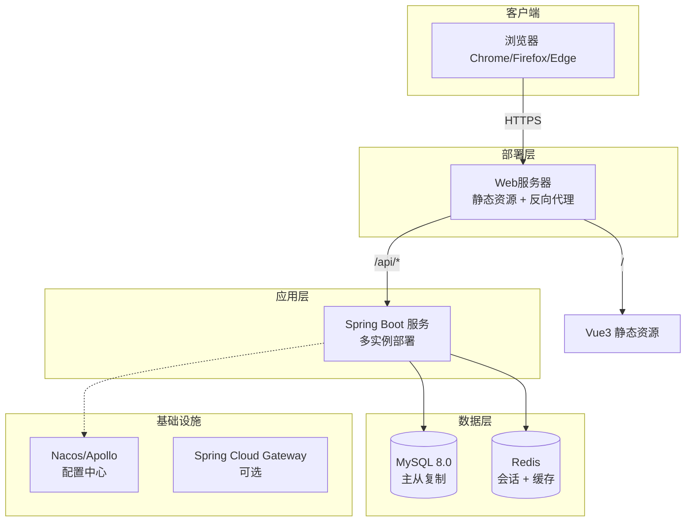

### 4.2 模块依赖关系

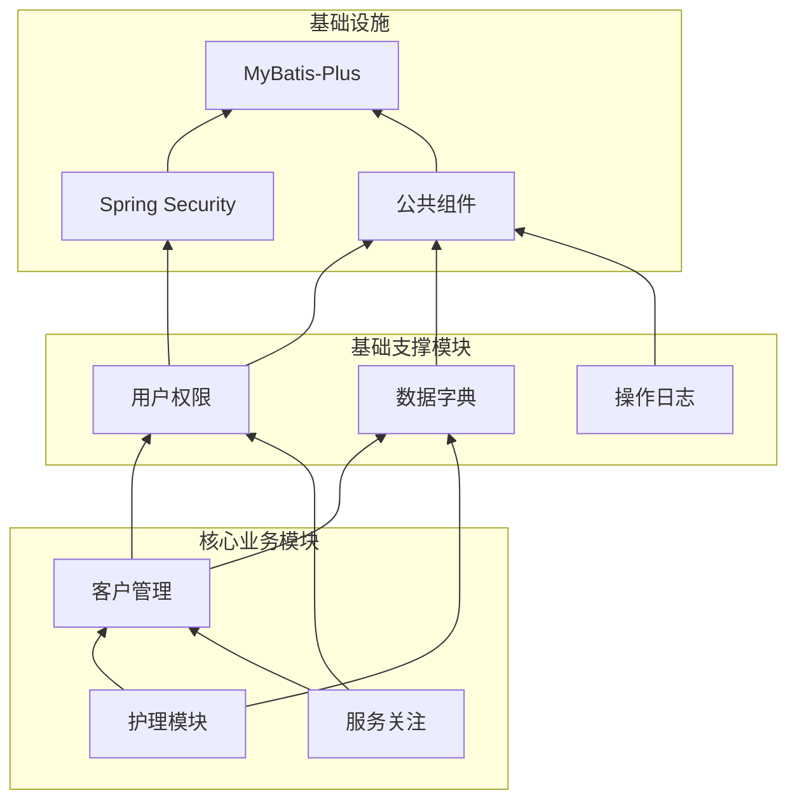

### 4.3 典型业务流程（入住登记）

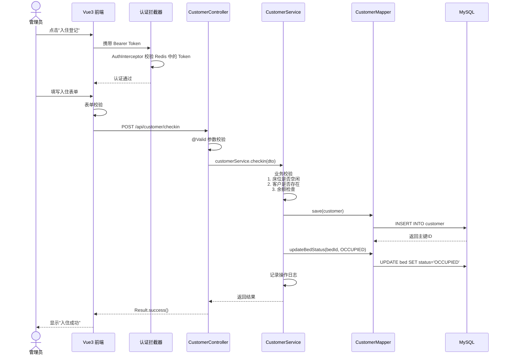

### 4.4 数据库 ER 图（核心实体）

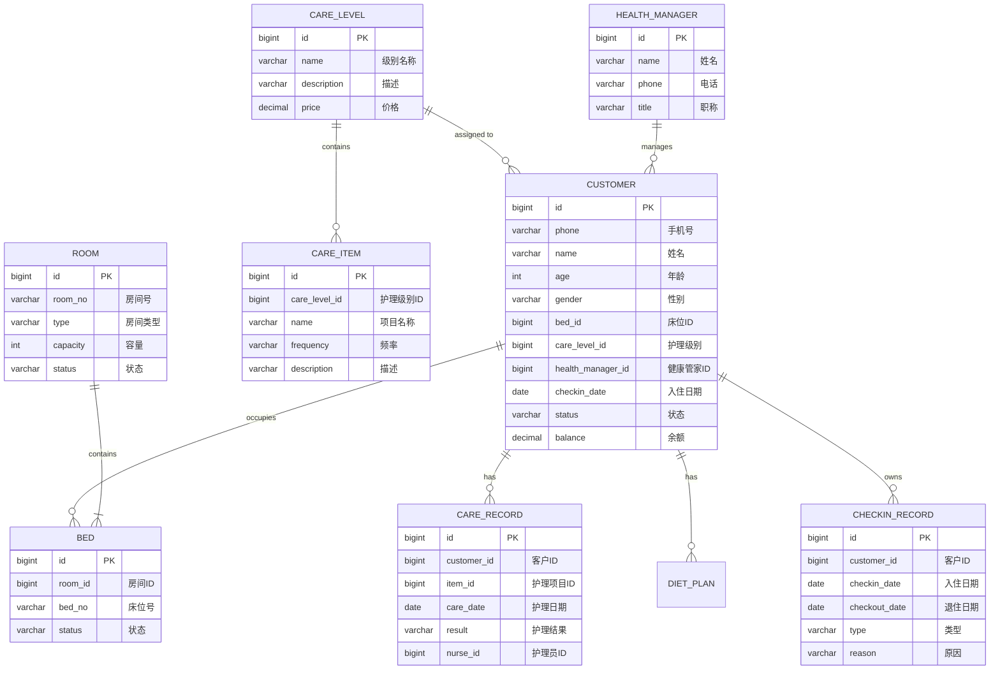

***

## 五、AI 编程优化策略

### 5.1 代码生成提示词模板

**Controller 层提示词模板**

```
生成 Spring Boot REST Controller，包含以下要求：
- 使用 @RestController 和 @RequestMapping
- 方法返回 Result<T> 统一响应
- 使用 @Valid 进行参数校验
- 包含 Swagger 注解 @ApiOperation
- 功能：{具体功能描述}
```

**Vue3 组件提示词模板**

```
生成 Vue3 + Element-Plus 组件，包含以下要求：
- 使用 Composition API 和 <script setup>
- 使用 TypeScript
- 包含表单校验规则
- 使用 Pinia Store 进行状态管理
- 功能：{具体功能描述}
```

### 5.2 项目结构标准化

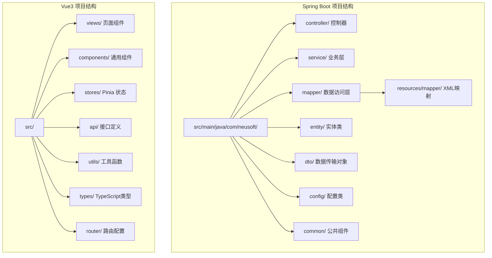

***

## 六、风险评估与缓解措施

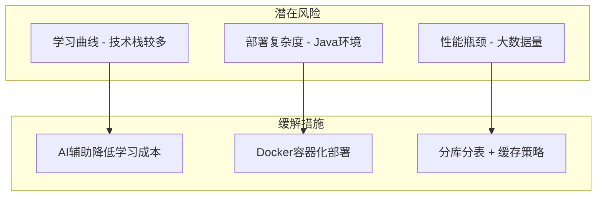

| 风险项          | 概率 | 影响 | 缓解措施                        |
| ------------ | -- | -- | --------------------------- |
| AI 生成代码质量不稳定 | 中  | 中  | 建立代码审查规范，核心逻辑人工校验           |
| 前端状态管理复杂     | 低  | 中  | Pinia 模块化设计，避免过度嵌套          |
| 数据库性能瓶颈      | 低  | 高  | 索引优化、读写分离、Redis缓存           |
| 安全漏洞         | 低  | 高  | Spring Security 标准配置，定期安全扫描 |

***

## 七、结论与建议

### 7.1 最终推荐方案

**首选方案：Spring Boot 3.x + Vue3 + Element-Plus + MyBatis-Plus**

### 7.2 推荐理由

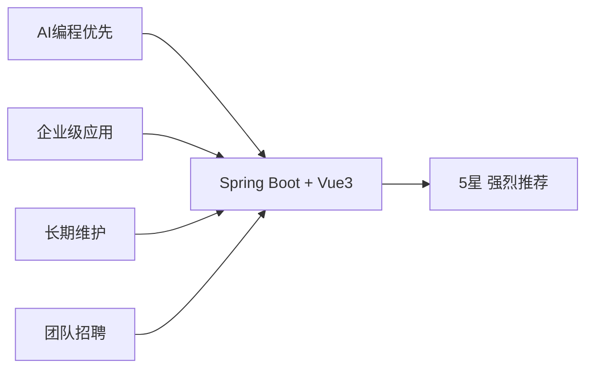

1. **AI 友好度最高**：训练数据丰富，代码生成准确率高
2. **企业级成熟度**：Spring Security、事务管理、审计日志完善
3. **中后台生态完善**：Element-Plus 表格/表单场景覆盖全面
4. **长期可维护性**：Java/Vue 人才市场供应充足
5. **渐进式演进**：可从单体逐步演进为微服务架构

### 7.3 备选建议

| 场景           | 建议方案           |
| ------------ | -------------- |
| 1个月内必须上线     | 若依/RuoYi 低代码平台 |
| 已有 Python 团队 | Django + Vue3  |
| 追求极致开发体验     | NestJS + React |

